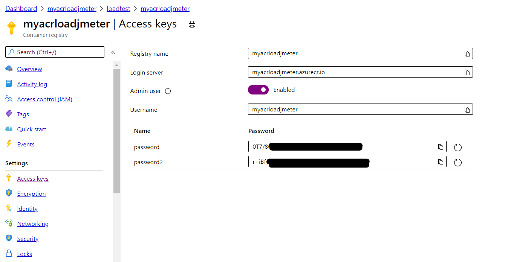
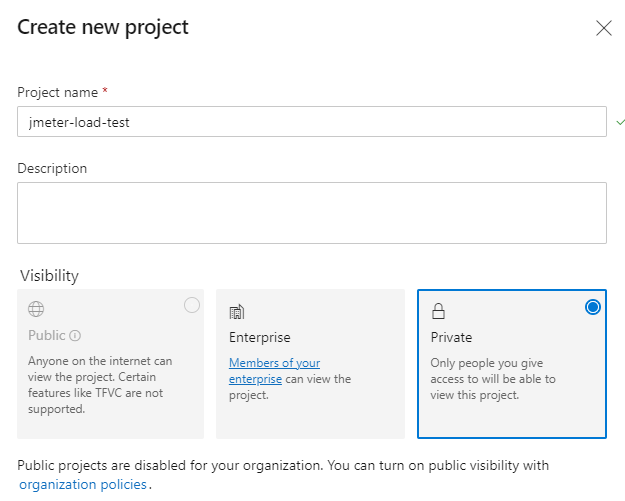
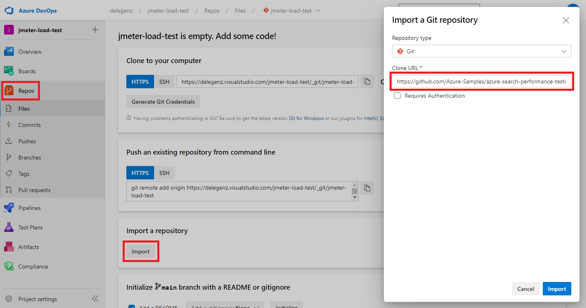
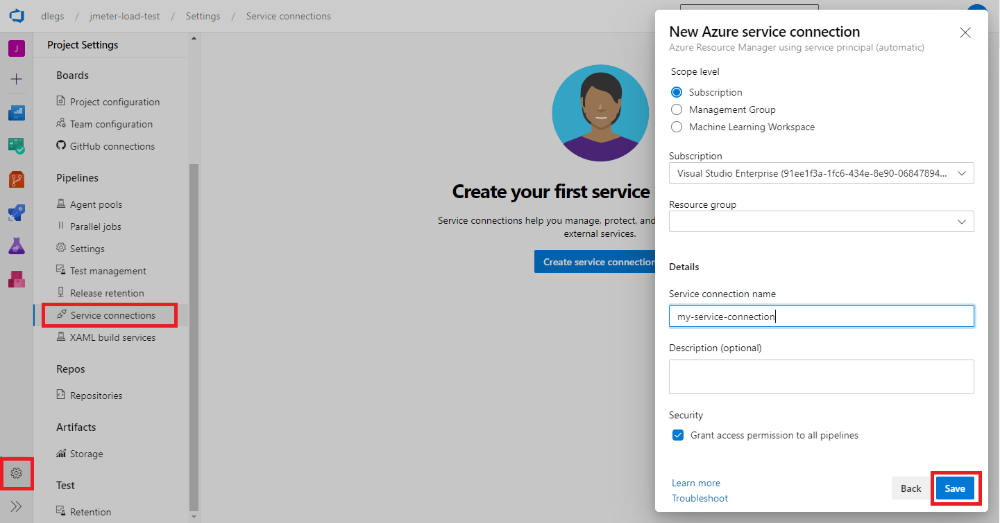
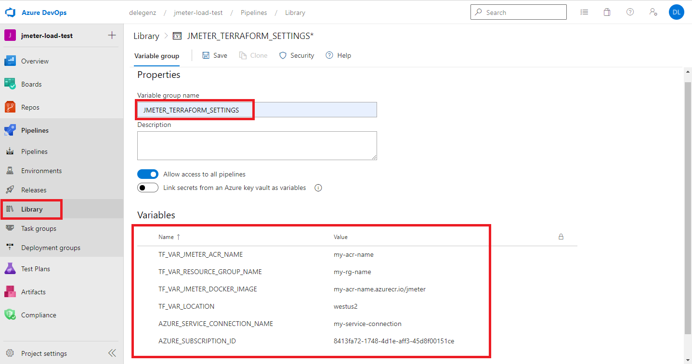
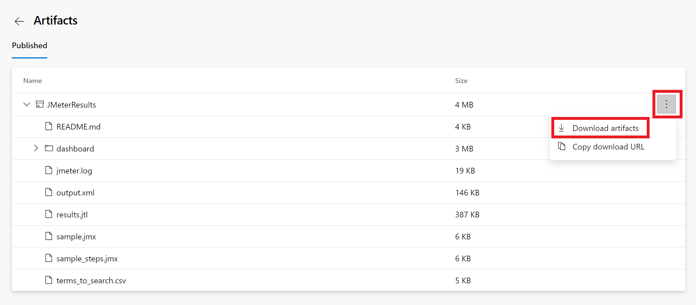
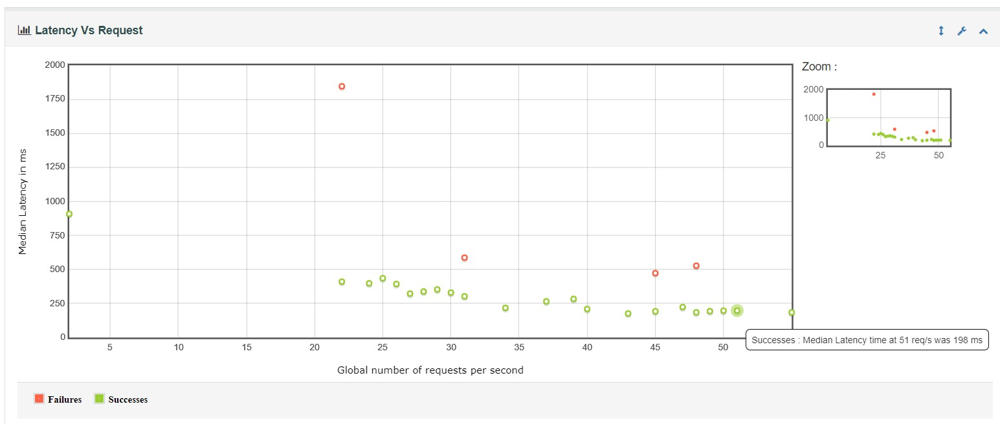
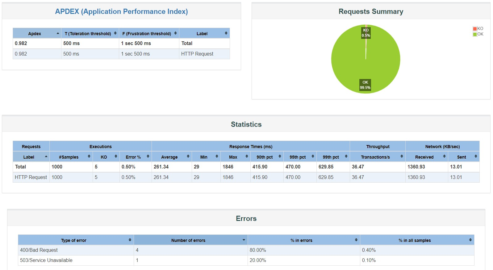

# Load Testing Pipeline with JMeter, ACI and Terraform

This pipeline helps to load test Azure Cognitive Search, it leverages [Apache JMeter](https://jmeter.apache.org/) as an open source load and performance testing tool and [Terraform](https://www.terraform.io/) to dynamically provision and destroy the required infrastructure on Azure. The JMeter workers and controller are hosted in Azure Container Instances (ACI) to allow VNET injection and Private Endpoint scenarios too.

Note: This is a fork from [this original repo](https://github.com/Azure-Samples/jmeter-aci-terraform) customized for Azure Cognitive Search (ACS) REST API and syntax.

## Key concepts

The flow is triggered and controlled by an [Azure Pipeline](https://azure.microsoft.com/en-us/services/devops/pipelines/) on [Azure DevOps](https://azure.microsoft.com/en-in/services/devops/). The pipeline contains a set of tasks that are organized logically in `SETUP`, `TEST`, `RESULTS` and `TEARDOWN` groups.

| Task group              | Tasks  |
|-------------------------|--------|
| SETUP | <li>Check if the JMeter Docker image exists</li><li>Validate the JMX file that contains the JMeter test definition</li><li>Upload JMeter JMX file to Azure Storage Account File Share</li><li>Provision the infrastructure with Terraform</li> |
| TEST | <li>Run JMeter test execution and wait for completion</li> |
| RESULTS | <li>Show JMeter logs</li><li>Get JMeter artifacts (e.g. logs, dashboard)</li><li>Convert JMeter tests result (JTL format) to JUnit format</li><li>Publish JUnit test results to Azure Pipelines</li><li>Publish JMeter artifacts to Azure Pipelines</li> |
| TEARDOWN | <li>Destroy all ephemeral infrastructure with Terraform</li> |

On the `SETUP` phase, JMeter agents are provisioned as [Azure Container Instance (ACI)](https://azure.microsoft.com/en-us/services/container-instances/) using a [custom Docker image](./docker/Dockerfile) on Terraform. Through a [Remote Testing](https://jmeter.apache.org/usermanual/remote-test.html) approach, JMeter controller is responsible to configure all workers, consolidating all results and generating the resulting artifacts (dashboard, logs, etc).

The infrastructure provisioned by Terraform includes:

* Resource Group
* Virtual Network (VNet)
* Storage Account File Share
* 1 JMeter controller on ACI
* N JMeter workers on ACI

On the `RESULTS` phase, a [JMeter Report Dashboard](https://jmeter.apache.org/usermanual/generating-dashboard.html) and [Tests Results](https://docs.microsoft.com/en-us/azure/devops/pipelines/test/review-continuous-test-results-after-build?view=azure-devops) are published in the end of each load testing execution.

## Prerequisites

You should have the following Azure resources:

* [Azure DevOps Organization](https://docs.microsoft.com/azure/devops/organizations/accounts/create-organization?view=azure-devops)
* [Azure Container Registry (ACR)](https://azure.microsoft.com/services/container-registry/) with admin user enabled 

## Getting Started using the UI

### 1. Create an Azure DevOps project and import this repo

Go to [Azure DevOps](https://dev.azure.com/), create a new project, and import this repo. 

Click into the **Repos** tab. You will get a warning saying that the repo is empty. Click on **Import a repository**, then for the Clone URL copy and paste this url: `https://github.com/ignaciofls/LoadTest-AzureCognitiveSearch-Jmeter-Terraform`

### 2. Create a service connection in Azure DevOps

Next, create a service connection in Azure Devops as described [in the DevOps documentation](https://docs.microsoft.com/en-us/azure/devops/pipelines/library/service-endpoints?view=azure-devops&tabs=yaml#create-a-service-connection). This service connection will create a service principal allowing the Azure Pipelines to access the resource group. 

> NOTE: Make sure to add the service connection at the subscription level (don't specify a resource group) so the service connection has access to install resource providers.

Make a note of the Service Connection name as it will be used in next step.

### 3. Creating the variable group

Create a variable group named `JMETER_TERRAFORM_SETTINGS` as described [in the DevOps documentation](https://docs.microsoft.com/en-us/azure/devops/pipelines/library/variable-groups?view=azure-devops&tabs=classic).

Add the following variables to the variable group:

* TF_VAR_JMETER_ACR_NAME = <your_azurecr_name>
* TF_VAR_RESOURCE_GROUP_NAME = <your_rg_name>
* TF_VAR_JMETER_DOCKER_IMAGE = <your_azurecr_name>.azurecr.io/jmeter
* AZURE_SERVICE_CONNECTION_NAME = <your_service_connection_name> 
* AZURE_SUBSCRIPTION_ID = <your_subscription_id>

When you're finished, the variable group should look similar to the image below:

### 4. Creating and running the Docker pipeline

Create a pipeline with **New Pipeline** (blue button, right side), chose **Azure Repos Git (YAML)**, click on your existing repo (cloned in step 1), configure the pipeline with **Existing Azure Pipelines YAML file**, the path of the existing file is **/pipelines/azure-pipelines.docker.yml**. 

A couple of extra steps before going to the JMeter deployment pipeline:
- Create two variables:
    * ACR_NAME = <your_azurecr_name>
    * ACR_RESOURCE_GROUP = <your_rg_name>
- Rename the new pipeline to `jmeter-docker-build` (in the Pipelines tab, find the three dots inside your pipeline row and there you can rename it)

### 5. Creating the JMeter pipeline

Replicate the steps as in step #4 but with yaml file **pipelines/azure-pipelines.load-test.yml** and rename to **jmeter-load-test**.
For this pipeline we will need some extra variables along with the two others:

  * API-KEY = <search_service_api_key>  (and keep it secret in devops)
  * TF_VAR_JMETER_JMX_FILE = sample.jmx
  * TF_VAR_JMETER_WORKERS_COUNT = 1 (or as many as you want for scalability of the JMeter workers)
  * ACR_NAME = <your_azurecr_name>
  * ACR_RESOURCE_GROUP = <your_rg_name>

Save the pipeline but don't run it yet. The [`sample.jmx`](./jmeter/sample.jmx) needs to be updated first as described in the next step.

### 6. Define the test definition inside your JMX file

By default the test uses [`sample.jmx`](./jmeter/sample.jmx). This JMX file contains a test definition for performing HTTP requests on `your_instance.search.windows.net` endpoint through the `443` port. 

> NOTE: You'll need to update `your_instance` with the name of your search service within sample.jmx. You'll also need to update `your_index_name` to the correct index name.

You can simply update the it with the test definition of your preference.

### 7. Run the JMeter Pipeline

Run the pipeline as in:

## Viewing Test Results

JMeter test results are created in a [JTL](https://cwiki.apache.org/confluence/display/JMETER/JtlFiles) file (`results.jtl`) with CSV formatting. A [Python script](https://github.com/Azure-Samples/jmeter-aci-terraform/blob/main/scripts/jtl_junit_converter.py) was created to convert JTL to [JUnit format](https://llg.cubic.org/docs/junit/) and used during the pipeline to have full integration with Azure DevOps test visualization.

Error messages generated by JMeter for failed HTTP requests can also be seen on Azure DevOps.

## Viewing Artifacts

Some artifacts are published after the test ends. Some of them are a static JMeter Dashboard, logs and others.

> You can also download these build artifacts using [`az pipelines runs artifact download`](https://docs.microsoft.com/en-us/cli/azure/ext/azure-devops/pipelines/runs/artifact?view=azure-cli-latest#ext-azure-devops-az-pipelines-runs-artifact-download).

After downloading the dashboard and unzipping it, open `dashboard/index.html` on your browser. Find an example under [this path](./docs/loadtestresults_withprivendpoint_1xstandard.zip)

Some screenshots here: 
 and 

## JMeter Test Configuration

The [sample.jmx](./jmeter/sample.jmx) includes some modules to configure the HTTP request, headers and body that Azure Cognitive Search is expecting. It also includes subsections to configure the query distribution (ie 10 concurrent users per second during 1 minute), a section to define which search terms will be sent (to avoid distortion in latencies thanks to cache) that read an input CSV. For more details and examples: [JMeter official doc](https://jmeter.apache.org/usermanual/component_reference.html).

If you struggle adding new modules to the .jmx (the syntax can be quite tricky) I would suggest to use JMeter's UI and save the config to a temporary jmx file, analyze the new module and embed it in your jmx config file.

## Pipeline Configuration

All Terraform parameters can be configured using the Variable Group `JMETER_TERRAFORM_SETTINGS`. Please read [JMeter Pipeline Settings](./docs/jmeter-pipeline-settings.md) to know more details about it.

## Limitations

* **Load Test duration**
Please note that for [Microsoft hosted agents](https://docs.microsoft.com/en-us/azure/devops/pipelines/agents/hosted?view=azure-devops#capabilities-and-limitations), you can have pipelines that runs up to 1 hour (private project) or 6 hours (public project). You can have your own agents to bypass this limitation.

* **ACI on VNET regions**
Please note that [not all regions](https://docs.microsoft.com/en-us/azure/container-instances/container-instances-virtual-network-concepts#where-to-deploy) currently support ACI and VNET integration. If you need private JMeter agents, you can deploy it in a different region and use VNET peering between them. Also note that vCPUs and memory limits change based on regions.

## Additional Documentation

* [Implementation Notes](./docs/implementation-notes.md)
* [Adding plugins to JMeter Docker image](./docs/adding-jmeter-plugins.md)
* [JMeter pipeline settings](./docs/jmeter-pipeline-settings.md)
* [Estimating costs](./docs/estimating-costs.md)
* [Integrating with Application Insights](./docs/integrating-application-insights.md)

## External References

* [User Manual: Remote Testing](https://jmeter.apache.org/usermanual/remote-test.html)
* [User Manual: Apache JMeter Distributed Testing Step-by-step](https://jmeter.apache.org/usermanual/jmeter_distributed_testing_step_by_step.html)
* [Azure DevOps CLI reference](https://docs.microsoft.com/en-us/cli/azure/ext/azure-devops/?view=azure-cli-latest)
* [Create your Azure Cognitive Search instance and populate an index with clinical trials docs](https://github.com/cynotebo/KM-Ready-Lab/blob/master/KM-Ready-Lab/workshops/Module%201.md)

## Future enhancements

* Creation of Container Registry with IaC as part of Terraform script
* Fully programmatic (CLI) provisioning and execution

## Contributing

This project welcomes contributions and suggestions.  Most contributions require you to agree to a
Contributor License Agreement (CLA) declaring that you have the right to, and actually do, grant us
the rights to use your contribution. For details, visit https://cla.opensource.microsoft.com.

When you submit a pull request, a CLA bot will automatically determine whether you need to provide
a CLA and decorate the PR appropriately (e.g., status check, comment). Simply follow the instructions
provided by the bot. You will only need to do this once across all repos using our CLA.

This project has adopted the [Microsoft Open Source Code of Conduct](https://opensource.microsoft.com/codeofconduct/).
For more information see the [Code of Conduct FAQ](https://opensource.microsoft.com/codeofconduct/faq/) or
contact [opencode@microsoft.com](mailto:opencode@microsoft.com) with any additional questions or comments.
